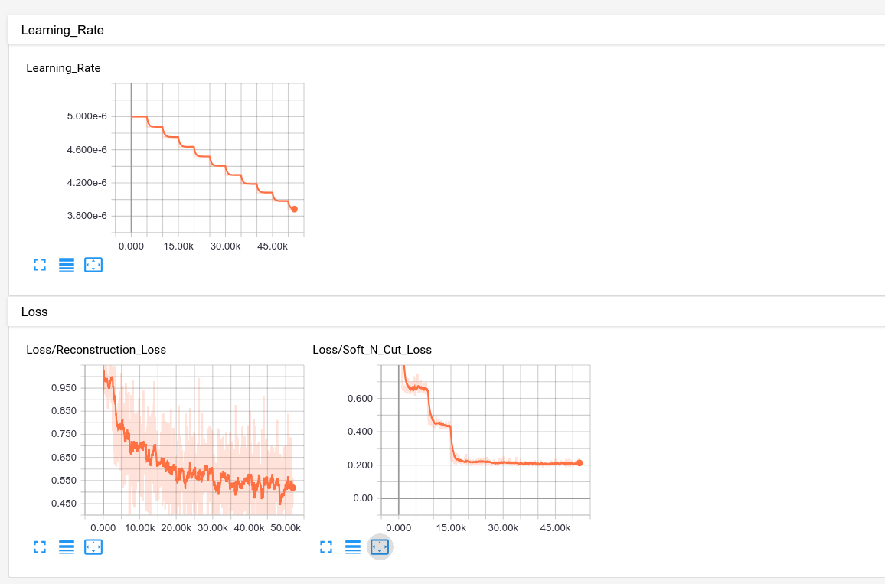
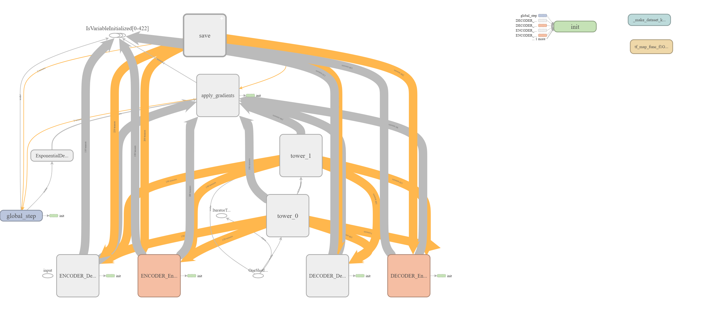
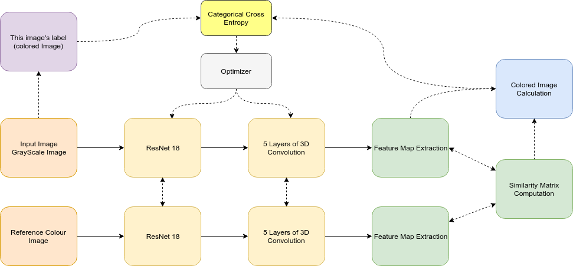
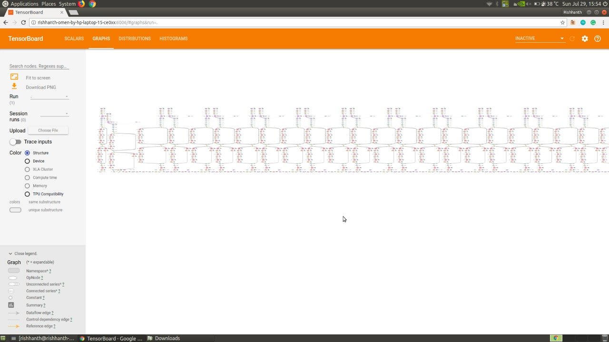
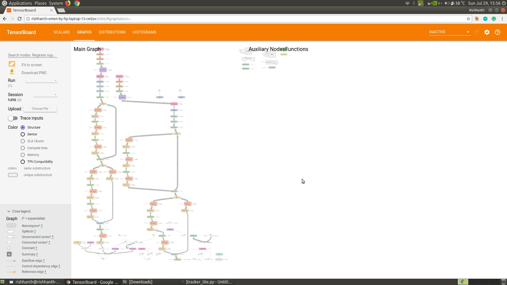

## Debugging TensorFlow Programs

---

Before seeing why debugging tensorflow program is difficult, lets see a sample program written in TensorFlow.

+++

```python
import numpy as np
import tensorflow as tf

x_data = np.linspace(-20,20, 100)
y_data = 5*x_data + 7 + np.random.randn(len(x_data))*0.05


x = tf.placeholder(tf.float32)
y = tf.placeholder(tf.float32)

global_step_tensor = tf.train.get_or_create_global_step()


W = tf.Variable(tf.random_uniform(shape = [],minval = 0,maxval = 100))
b = tf.Variable(tf.random_uniform(shape = [],minval = -100,maxval = 100))

yPred = W*x + b

loss = tf.reduce_sum(tf.square(y - yPred))
tf.summary.scalar('Loss', loss)
tf.summary.scalar('weight', W)
tf.summary.scalar('bias', b)


LEARNING_RATE = 0.0000015
train_step = tf.train.GradientDescentOptimizer(LEARNING_RATE).minimize(loss, global_step=global_step_tensor)

sess = tf.Session()
init = tf.global_variables_initializer()
sess.run(init)


merged = tf.summary.merge_all()
train_writer = tf.summary.FileWriter('train_logs',sess.graph)
while True:
    _, summary, step, l2loss = sess.run([train_step, merged, global_step_tensor, loss],feed_dict={x:x_data, y:y_data })
    train_writer.add_summary(summary, step)
    print ("Iteration: " + str(step) + " Loss: " + str(l2loss))
```
@[1-2](Necessary libraries are imported)
@[4-5](Synthetic Input data is created)
@[11](Creating the global step tensor, where we will store the amount of iterations passed in the graph)
@[14-15](Initialising the weights and biases)
@[17](Defining our linear model)
@[19](Defining our Loss function (L2 Difference)
@[20-22](Defining Tensorboard summary Scalars)
@[25-26](Learning Rate and Optimizers are defined (Gradient Descent Optimization)
@[28-30](Creating **Tensorflow Session** and running initialization operation)
@[33-38](Training Loop)

---

In the above program, what will happen if I write 

```python
# Lets print the weights in linear regression model
print (W)
```

Whats the output you expect?

+++

```
<tf.Variable 'Variable:0' shape=() dtype=float32_ref>
```

This is not the number we expected right?

---

In tensorflow what happens whe you write a program is,
@ul

- Construction of Computational graph
- Create a tf.Session() wrapper to access the values in the graph
- Placeholders are input to the graph.
    - Use feed_dict to feed the values to the graph

@ulend

+++


---
#### Why Debugging TensorFlow programs is difficult?

@ul

- The concept of Computational Graph
- "Inversion of Control"
    - The actual computation of the tensors happens only during sess.run(), **not during our python code definition we write**.
- Intermidiate hidden layers remain hidden (unless we specify them with sess.run()). Normal print statements dont work the way intended.

@ulend

---

# Debugging Facilities Present in Tensorflow

---

### Wishlist

@ul

- Inspect the hidden layers activations
- Check the dimensions of tensors (to avoid shape mismatch)
- Inspect the paramters of your model
- Ability to use print statements
- Visualizing tools for tensors in the program
- Check for NaNs, inf in the models

@ulend

---

### Different Debugging Techniques in Tensorflow

- sess.run()
- TensorBoard: Visualizing Learning
    - Different Plugins will be explored
- tf.Print( Operation
- tf.assert()

---

### Monitoring Tensors using Session.run()

```python
x = tf.placeholder(tf.float32)
y = tf.placeholder(tf.float32)

W = tf.Variable(2.0)
b = tf.Variable(1.0)

yPred = W*x + b

loss = tf.square(y - yPred)

print (loss)
print (sess.run(loss, feed_dict={x:2.0, y:4.0}))
print (sess.run(loss, feed_dict={x:7.0}))
print (sess.run(yPred, feed_dict={x:5.0}))
print (sess.run(yPred, feed_dict={x:3.0, y=1.0}))
```
@[11](Whats the output? We saw it earlier right?)
@[12](Output in this case?)
@[13](Output in this case?)
@[14](Output in this case?)
@[15](Output in this case?)

---

The weights and actiivations can be obtained from the tensorflow graph.

```python
inputs = tf.placeholder(tf.float32, shape=(None, X_train.shape[1]), name='inputs')
label = tf.placeholder(tf.float32, shape=(None, 2), name='labels')

# First layer
hid1_size = 128
w1 = tf.Variable(tf.random_normal([hid1_size, X_train.shape[1]], stddev=0.01), name='w1')
b1 = tf.Variable(tf.constant(0.1, shape=(hid1_size, 1)), name='b1')
y1 = tf.nn.dropout(tf.nn.relu(tf.add(tf.matmul(w1, tf.transpose(inputs)), b1)), keep_prob=0.5)

# Second layer
hid2_size = 256
w2 = tf.Variable(tf.random_normal([hid2_size, hid1_size], stddev=0.01), name='w2')
b2 = tf.Variable(tf.constant(0.1, shape=(hid2_size, 1)), name='b2')
y2 = tf.nn.dropout(tf.nn.relu(tf.add(tf.matmul(w2, y1), b2)), keep_prob=0.5)

# Output layer
wo = tf.Variable(tf.random_normal([2, hid2_size], stddev=0.01), name='wo')
bo = tf.Variable(tf.random_normal([2, 1]), name='bo')
yo = tf.transpose(tf.add(tf.matmul(wo, y2), bo))

loss = tf.reduce_mean(tf.nn.softmax_cross_entropy_with_logits(logits=yo, labels=label))
```
@[4-8](First Layer of the Feed forward Neural net)
@[10-14](Second Layer of the Neural Net)
@[16-19](Third Layer)
@[21](The Cross Entropy Loss function)

+++

```python
# This is how we can inspect parameters of the network
first_w, first_b, sec_w, sec_b = sess.run([w1, b1, w2, b2])
loss_val = sess.run(loss, feed_dict={x:batch_x, y:batch_y})
```

---
### Advantages and Disadvantages of sess.run()

@ul

- Similar to print statement kind of debugging
- Easy to use
- Difficult when analysing multi-dimensional arrays
- Visualising interface not present
- If the model is complex with many layers, handling many tensors can become cumbersome.

@ulend

---

## TensorBoard: Visualizing Learning

---

Training a massive deep neural network can be complex and confusing.

TensorFlow provides a suite of visualization tools called TensorBoard, to make it easier to understand, debug, and optimize TensorFlow programs.

+++


---

#### Working of TensorBoard: Overview

@ul

- You need to record what you want to visualize. It can be scalar variables, images, projections etc.
- After you register what you want to visualise and how to visualise, you need to create a merged operation in the tensorflow graph
- Then the serialized summary object which is created when this merged operation is executed, we must write it in the disk
- Launch a local client server model architecture to visualise the data in the file stored in the disk

@ulend

---
### Scalars

@ul

- Just numbers, unlike vectors, matrices or tensors.
- Can be visualised in a graph where the value of the scalar varies with the iteration (global step)
- Can you think of examples?
    - Accuracy
    - Loss Value
    - In case of matrices or vectors, you can visualise a metric such as minimum value or maximum value in that tensor. (Mean and standard deviation are also used frequently).

@ulend

---

Example: How to create tensorflow scalar summaries

```python
def create_scalar_summary(x):
    with tf,name_scope('summaries'):
        # Registering the operations we want to visualise
        max = tf.reduce_max(x)
        tf.summary.scalar('max', max)
        tf.summary.scalar('min', tf.reduce_min(x))
        tf.summary.scalar('mean', tf.reduce_mean(x))

# Sample Call Statement
create_scalar_summary(hidden_2)
```

+++



---
### Graph

This plugin in is a tool we can use to visualize the computational graph that tensorflow builds. There are a lot of options available like checking TPU compatibility, in which devices operations are being executed, etc

+++



---

Time to test your understanding !

Debug this program !!


+++

Observations

@ul

- Code written and runs with no errors
- The training slows down as the iterations increases
- The program stops running by throwing a resource exhausted error

@ulend

+++

#### Overview of the architecture



+++



+++



---

#### TensorBoard's Histograms and Distributions

The TensorBoard Histogram Dashboard displays how the distribution of some Tensor in your TensorFlow graph has changed over time. It does this by showing many histograms visualizations of your tensor at different points in time.

+++

```python
# First layer of weights
with tf.name_scope("layer1"):
    W1 = tf.get_variable("W1", shape=[input_size, hidden_layer_neurons],
                         initializer=tf.contrib.layers.xavier_initializer())
    layer1 = tf.matmul(X, W1)
    layer1_act = tf.nn.tanh(layer1)
    tf.summary.histogram("weights", W1)
    tf.summary.histogram("layer", layer1)
    tf.summary.histogram("activations", layer1_act)
```
+++


+++

#### What do you observe from these histograms?

+++


[StackOverFlow Question](https://stackoverflow.com/questions/42315202/understanding-tensorboard-weight-histograms)

+++
### Fetching histogram summary is extremely slow!

 - GPU utilization can become very low (if the serialized values are huge)
 - Only use histogram summaries when debugging need arises.
 - Call the histogram summaries periodically and disable them when not needed.

---
## Tensorboard's Beholder Plugin

+++


The Beholder plugin shows a live video feed of tensor data in TensorBoard during model training. It can display model variable values, arbitrary NumPy arrays (e.g. for gradients or activations), or pre-existing image frames.

+++

```python
from tensorboard.plugins.beholder import Beholder
beholder = Beholder(LOG_DIRECTORY)

# inside train loop
beholder.update(
  session=sess,
  arrays=list_of_np_ndarrays,  # optional argument
  frame=np_ndarray,  # optional argument
)
```
+++
By default, Beholder will visualize `tf.trainable_variables()`, but two optional
arguments can provide additional data sources for visualization:

- `arrays`: a list of NumPy `ndarray` values, interpreted as described below

- `frame`: an `ndarray` of shape `[height, width, channels]` for direct display
  via [`tf.image.encode_png`][encode-png] (if omitted, `channels` is set to 1),
  or a function that returns such an array (to skip generation if not displayed)

+++


---

### Print Statement in TensorFlow

- Doesnt seem to work like a normal print statement works
- Often idea is that print statement is something which is used to add on the side of our normal flow.
- Whereas in TensorFlow, only nodes in the graph that needs to be executed will be executed.


+++

#### Dangling Print operation


+++

In order for the print operation to execute properly that must be connected serially...

+++


+++

### Syntax of tensroflow print statement

> tf.Print(input_, data, message=None, first_n=None, summarize=None, name=None)

- input_ : A tensor passed through the graph
- data: A list of tensors to be printed when this op is evaluated
- message: A prefix string
- first_n: Only log `first_n` number of times. 
- summarize: Only prints this many entries of each tensor. If `None`, maximum of 3 elements are printed
- name: Name of the operation

+++

> Output slide, example

---

#### Assertion in tf

- Asserts whether the supplied condition is true when evaluated.
- If condition is evaluates to `False`, print the list of tensors in `data` and an error is thrown. `summarize` determines how many tensors to print similar to `tf.Print`.

> tf.Assert(condition, data, summarize=None, name=None)

+++

> EXAMPLE and CODE OUTPUT

---

## Live demo - How to use Tensorflow UI Debugger

---

# Other tips

---

- Use `Asserts`
- Proper `logging` is essential. Log all possible paramters
- Use numerically stable operations. Helps you against getting `NaN` problems. $\sqrt{-1}, \infty$ gradient values can cause irritation.
- Utilize `tf.name_scope` properly, name all ops properly.

+++

- Check `GPU` Utilization, and ensure its always at its maximum.
- Remove histogram summaries if you are not in debugging mode. This heavily affects gpu performance.
- `nvidia-smi -l 1` is a worthy command to remember
- Check for I/O bounds in your program. Optimize it (data reading from and writing to disk)
- Profile in case you suspect.

---

# Thank you
